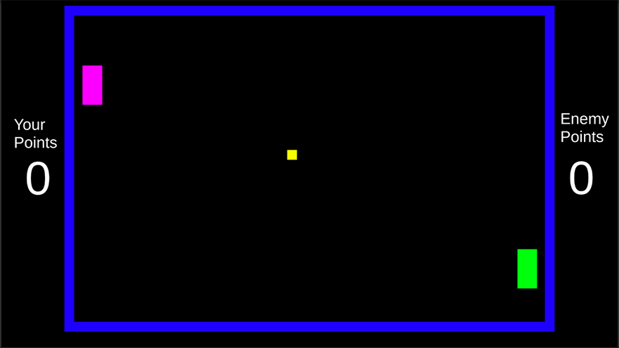

# Pong
## Description
A recreation of the classic Atari game Pong but with an AI enemy instead of 2 Player

# Author
[Ariana Castro](url)

# Assets
### <ins> Unity Assets </ins>

  
  - Cubes
  
  - Default Unity UI
  
  

  
  ### <ins> Link Below </ins>
  <a href="https://arianacastro01.itch.io/pong">
  
  
  

# License
This project is licensed under the GNU Affero General Public License v3.0 License - see the LICENSE.md file for details
